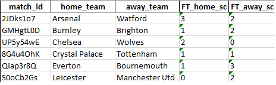

# FlashScore scraper

It is my first web scraping script. I am interested in football and stiatistics of all kind and that's why I chose to scrape match details and results from FlashScore.com.

## How does it work?
Firstly, it gets ids of all matches on a given page (scrolls and presses "More" button untill there are more matches to load). For example it may be page with results of all maches in Premier League in season 19/20.
Next thing is opening every match by scraped ids and getting match details.
At the end everything is stored in pandas dataframe and saved into excel.

To get all the data script needs to work about 80 minutes and this is because loading time of all pages it need to go to. For each match there are 3 pages to load.

Main script (the one descriped above) is [main.py](../master/main.py).

Currently working on [main2_autoscrape.py](../master/main2_autoscrape.py) and this will be main program here. At this moment [main.py](../master/main.py) is obsolete. When I finish working on [main2_autoscrape.py](../master/main2_autoscrape.py) I will refactor code in both scripts. 

## Scraped data
Teams and lineups (first squad and subs), score, statistics (fulltime, first half and second half for every statistic) for example: ball possession, shots on target, shots off target, saves, cards and passes.
For every match scraped are also all incidents that happend during a match. They are for example: goals, yellow and red cards, substitutions. For every of them there are also more details (scorer, assist, sub in - sub out, own goal, penalty kick missed, VAR).

Scraped data includes 190 columns. In one Premier League season there are 380 matches.

## Technologies used:
- Python 3
- Spyder
- Selenium
- chromedriver / geckodriver
- BeautifulSoup4
- pandas

## Fragments of scraped data

